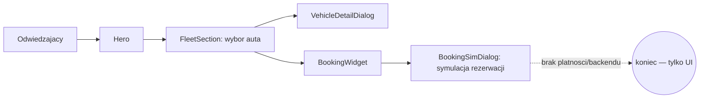

# ARCHITECTURE — mapa dla obcego (1 strona)

<!-- Cel: senior, ktory nigdy nie widzial repo, znajduje miejsce zmiany w 15 min. -->

## Co to jest (3 zdania)
Demo site "NordCar Iceland" — **fikcyjna** wypożyczalnia aut, zbudowana jako pokazowy przykład
dla klientów agencji [Reykjawwwik](https://reykjawwwik.is) (website-as-a-service, Islandia).
Pitch produktu: cena widoczna od razu = cena końcowa (ubezpieczenie, GPS, opony zimowe,
assistance 24/7 wliczone, zero opłat na miejscu). Zero prawdziwych danych klientów, rezerwacji
ani płatności — to wizytówka sprzedażowa dla branży rental, nie działający system.

## Stack (z package.json / README)
- Frontend: React + TypeScript, Vite, react-router-dom (1 realna trasa), TanStack Query (bez realnych zapytań)
- UI: Tailwind CSS + shadcn/ui (Radix), lucide-react
- Backend/DB: **brak** — demo nie ma nic do trwałego zapisu
- i18n: `src/i18n/LanguageContext.tsx` + `translations.ts`
- Testy: Playwright E2E + Vitest (`src/test/`)
- Hosting: **Lovable** (`lovable-tagger` w `vite.config.ts`) — `git push` na `main` NIE deployuje,
  aktualizacja produkcji = ręczny **Publish** w Lovable UI

## Moduły i granice (co jest gdzie)
| Katalog / plik | Odpowiedzialność | Tier |
|---|---|---|
| `src/pages/Index.tsx` | jedyna realna strona — składa wszystkie sekcje one-page | T1 |
| `src/components/FleetSection.tsx` | przeglądanie floty wg kategorii (SUV/camper/4x4/EV) z ceną/dzień | T1 |
| `src/components/BookingWidget.tsx` / `BookingSimDialog.tsx` | symulowany formularz rezerwacji — bez backendu, kończy się modalem "to by..." | T1 |
| `src/components/DemoDialog.tsx` | rdzeń demo-mechaniki: podmienia realne akcje (płatność, redirect) na komunikat informacyjny | T1 |
| `src/components/VehicleDetailDialog.tsx` | szczegóły pojazdu (modal) | T1 |
| `src/components/InsuranceCompare.tsx` / `InsuranceSection.tsx` | prezentacja "no hidden fees" — porównanie z konkurencją | T1 |
| `src/components/app-showcase/*` | mockup telefonu (`PhoneMockup.tsx`) pokazujący hipotetyczną apkę mobilną | T0 |
| `src/i18n/*` | słownik i kontekst języka | T1 |
| `src/components/svg/*` | dekoracje SVG (motyw islandzki: kompas, zorza, topografia) | T0 |

## Przepływ użytkownika

## Gdzie jest…
- ceny/kategorie floty: `src/components/FleetSection.tsx`
- teksty PL/EN/IS: `src/i18n/translations.ts`
- symulacja rezerwacji/płatności: `src/components/BookingSimDialog.tsx`, `DemoDialog.tsx` — nie realna integracja
- sekrety: brak (zero integracji zewnętrznych)

## Decyzje nieodwracalne
`docs/adr/` — zobacz istniejące ADR w repo.

## Jak to cofnąć / kill switch
Strona statyczna bez backendu — rollback = Lovable "Revert to this version" albo `git revert` + Publish.
